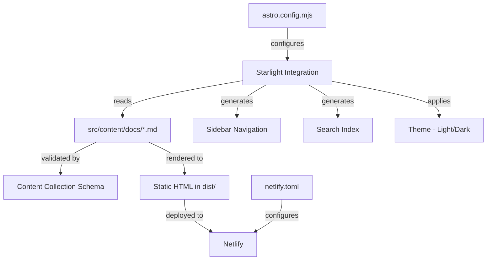

# Design Document

## Overview

The DreamSprite documentation site is a statically generated website built with Astro and the Starlight documentation theme. Starlight provides a batteries-included documentation experience — sidebar navigation, search, dark/light mode, and content collection validation — out of the box. The site will be deployed to Netlify.

The project follows Astro's standard conventions: content lives as Markdown files in `src/content/docs/`, configuration is centralized in `astro.config.mjs`, and Starlight handles layout, navigation, and theming. The build produces a `dist/` directory of static assets ready for Netlify hosting.

## Architecture



The architecture is straightforward since Starlight handles most of the heavy lifting:

1. **Configuration Layer** — `astro.config.mjs` defines the Starlight integration with site title, sidebar structure, and any customizations.
2. **Content Layer** — Markdown files in `src/content/docs/` are the documentation source. Starlight's content collection schema validates frontmatter at build time.
3. **Build Layer** — Astro's build process renders Markdown to static HTML, generates the search index, and produces the `dist/` output.
4. **Deployment Layer** — `netlify.toml` tells Netlify how to build and where to find the output.

## Components and Interfaces

### 1. Astro Configuration (`astro.config.mjs`)

The central configuration file that wires everything together:

- Registers the `@astrojs/starlight` integration
- Sets the site title to "DreamSprite"
- Defines the sidebar structure with groups and links
- Configures any social links or additional Starlight options

```javascript
// astro.config.mjs
import { defineConfig } from "astro/config";
import starlight from "@astrojs/starlight";

export default defineConfig({
  integrations: [
    starlight({
      title: "DreamSprite",
      sidebar: [
        { label: "Getting Started", slug: "getting-started" },
        {
          label: "Guides",
          items: [{ label: "Creating Assets", slug: "guides/creating-assets" }],
        },
      ],
    }),
  ],
});
```

### 2. Content Collection (`src/content/docs/`)

Documentation pages are Markdown files with YAML frontmatter. Starlight defines the schema via its built-in content collection config. Each file must include at minimum a `title` field.

**Frontmatter interface:**

```yaml
---
title: string # Required — used in sidebar and page heading
description: string # Optional — used in meta tags
---
```

### 3. Landing Page (`src/content/docs/index.mdx`)

Starlight supports a special `hero` frontmatter for the index page, providing a hero section with title, tagline, and call-to-action buttons. This serves as the landing page.

### 4. Netlify Configuration (`netlify.toml`)

Specifies build settings for Netlify:

```toml
[build]
  command = "npm run build"
  publish = "dist"
```

### 5. Starlight Built-in Components

Starlight provides these out of the box (no custom code needed):

- **Sidebar** — auto-generated from config or directory structure
- **Search** — Pagefind-based full-text search, built at build time
- **Theme Toggle** — light/dark mode with preference persistence
- **Header** — site title and navigation

## Data Models

### Content File Schema

Starlight uses Astro's content collection system. The schema is defined by Starlight's `docsSchema` and validates:

| Field         | Type     | Required | Description                        |
| ------------- | -------- | -------- | ---------------------------------- |
| `title`       | `string` | Yes      | Page title for heading and sidebar |
| `description` | `string` | No       | Meta description for SEO           |
| `sidebar`     | `object` | No       | Override sidebar label/order       |
| `hero`        | `object` | No       | Hero section config (index page)   |
| `template`    | `string` | No       | Page template (`doc` or `splash`)  |

### Sidebar Configuration Schema

Defined in `astro.config.mjs` within the Starlight integration options:

| Field   | Type            | Description                       |
| ------- | --------------- | --------------------------------- |
| `label` | `string`        | Display text in sidebar           |
| `slug`  | `string`        | Link to a specific doc page       |
| `items` | `SidebarItem[]` | Nested items for grouped sections |

### Netlify Configuration Schema

Defined in `netlify.toml`:

| Field     | Type     | Description                     |
| --------- | -------- | ------------------------------- |
| `command` | `string` | Build command (`npm run build`) |
| `publish` | `string` | Output directory (`dist`)       |

## Correctness Properties

_A property is a characteristic or behavior that should hold true across all valid executions of a system — essentially, a formal statement about what the system should do. Properties serve as the bridge between human-readable specifications and machine-verifiable correctness guarantees._

This project is primarily a static site built with Astro/Starlight, so most requirements are structural (file existence, config correctness) and are best validated as examples. However, the following properties hold universally across content:

### Property 1: Content file to URL path mapping

_For any_ Markdown file placed in `src/content/docs/` with a valid path `P`, building the site should produce an HTML file at a URL path that matches `P` (with the `.md` extension removed and directory separators preserved as URL segments).

**Validates: Requirements 2.2**

### Property 2: Frontmatter title appears in rendered output

_For any_ content file with a `title` field in its frontmatter, the rendered HTML page should contain that exact title string within an `<h1>` heading element.

**Validates: Requirements 2.4**

### Property 3: Valid frontmatter passes schema validation

_For any_ content file with frontmatter containing a non-empty `title` string and only fields defined in the Starlight docs schema, the Astro build process should succeed without validation errors for that file.

**Validates: Requirements 6.1**

## Error Handling

Since this is a static site generator project, error handling is primarily at build time:

1. **Invalid Frontmatter** — Astro's content collection validation will report descriptive errors when frontmatter doesn't match the Starlight schema. The build will fail with a clear error message pointing to the offending file and field. (Requirement 6.2)

2. **Missing Content Files** — If a sidebar entry references a slug that doesn't have a corresponding content file, the Astro build will produce a warning or error. The sidebar configuration should only reference existing content files.

3. **Build Failures** — Any syntax errors in `astro.config.mjs` or malformed Markdown will cause the build to fail with Astro's standard error output, which includes file paths and line numbers.

4. **Netlify Build Failures** — If the build fails on Netlify, the deployment will not proceed. Netlify's build logs will show the Astro error output for debugging.

## Testing Strategy

### Build Validation Testing

The primary testing approach for this project is build validation — ensuring the Astro build completes successfully and produces the expected output. This is done by running `npm run build` and inspecting the `dist/` directory.

### Unit Testing

Unit tests will verify specific structural expectations about the project and build output:

- Verify that required files exist (`astro.config.mjs`, `package.json`, `netlify.toml`, content files)
- Verify that `package.json` contains the required dependencies
- Verify that `netlify.toml` has correct build command and publish directory
- Verify that the build output contains expected HTML files
- Verify that the landing page HTML contains the hero section and navigation links

Testing framework: **Vitest** (Astro's recommended test runner, already compatible with the Astro ecosystem).

### Property-Based Testing

Property-based tests will verify universal properties across all content files using **fast-check** as the PBT library with Vitest as the test runner.

Each property-based test will:

- Run a minimum of 100 iterations
- Be tagged with a comment in the format: `**Feature: astro-docs-site, Property {number}: {property_text}**`
- Test a single correctness property from the design document

Property tests will focus on:

- Generating random valid frontmatter and verifying schema acceptance (Property 3)
- Generating random file paths and verifying URL mapping consistency (Property 1)
- Generating random title strings and verifying they appear in rendered output (Property 2)

### Test Organization

- Tests will be placed in a `tests/` directory at the project root
- Unit tests: `tests/structure.test.ts` and `tests/build-output.test.ts`
- Property tests: `tests/properties.test.ts`
- All tests run via `npx vitest run`
