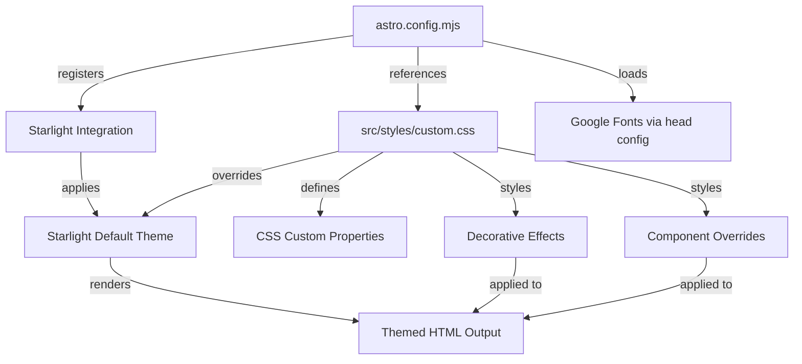

# Design Document

## Overview

The DreamSprite theme redesign transforms the default Starlight documentation theme into a "dreamy dark academia" aesthetic. The implementation uses Starlight's built-in CSS custom property system for core color/font overrides, supplemented by a custom CSS file for decorative effects, component styling, and layout refinements. Google Fonts are loaded for the serif heading font and monospace code font. All customizations are additive — they layer on top of Starlight's existing structure rather than replacing it.

The approach prioritizes:

- Maintainability: CSS custom properties and a single custom stylesheet
- Performance: minimal JS, CSS-only effects, lazy-loaded images
- Accessibility: WCAG AA contrast ratios verified for all text/background combinations
- Compatibility: works with Starlight's existing component structure and future updates

## Architecture



The architecture has three layers:

1. **Starlight CSS Custom Properties** — Override Starlight's `--sl-color-*` variables in `:root` to set the core palette (backgrounds, text, accents).
2. **Custom CSS File** (`src/styles/custom.css`) — Additional styles for decorative effects (starry overlay, glows, parchment callouts), typography refinements, and component-specific overrides.
3. **Font Loading** — Google Fonts (Playfair Display, JetBrains Mono) loaded via Starlight's `head` configuration in `astro.config.mjs`.

## Components and Interfaces

### 1. Astro Configuration Updates (`astro.config.mjs`)

The config registers the custom CSS file and loads Google Fonts:

```javascript
import { defineConfig } from "astro/config";
import starlight from "@astrojs/starlight";

export default defineConfig({
  integrations: [
    starlight({
      title: "DreamSprite",
      customCss: ["./src/styles/custom.css"],
      head: [
        {
          tag: "link",
          attrs: {
            rel: "preconnect",
            href: "https://fonts.googleapis.com",
          },
        },
        {
          tag: "link",
          attrs: {
            rel: "preconnect",
            href: "https://fonts.gstatic.com",
            crossorigin: true,
          },
        },
        {
          tag: "link",
          attrs: {
            rel: "stylesheet",
            href: "https://fonts.googleapis.com/css2?family=Playfair+Display:wght@400;700&family=JetBrains+Mono:wght@400;500&display=swap",
          },
        },
      ],
      sidebar: [
        { label: "Getting Started", slug: "getting-started" },
        {
          label: "Guides",
          items: [{ label: "Creating Assets", slug: "guides/creating-assets" }],
        },
      ],
    }),
  ],
});
```

### 2. Color Palette

| Token                | Hex       | Usage                                                |
| -------------------- | --------- | ---------------------------------------------------- |
| Primary Background   | `#0F0F1A` | Page body, main background                           |
| Secondary Background | `#1A1A2E` | Cards, code blocks, sidebar, sections                |
| Tertiary Background  | `#16213E` | Hover states, active sidebar items                   |
| Body Text            | `#E0E0FF` | Main content text (pale moonlight)                   |
| Secondary Text       | `#B0B0D8` | Descriptions, meta text (dusty lavender)             |
| Accent Primary       | `#C9A0DC` | Links, buttons, active states (soft lavender-purple) |
| Accent Secondary     | `#A8E6CF` | Icons, subtle glows (pale mint)                      |
| Gold                 | `#D4AF37` | Callout borders, special highlights                  |
| Danger/Warning       | `#E57373` | Error callouts, warnings                             |

Contrast ratios (verified against WCAG AA):

- `#E0E0FF` on `#0F0F1A` → ~14.5:1 (passes AAA)
- `#B0B0D8` on `#0F0F1A` → ~8.5:1 (passes AAA)
- `#C9A0DC` on `#0F0F1A` → ~7.2:1 (passes AA)
- `#E0E0FF` on `#1A1A2E` → ~11.8:1 (passes AAA)

### 3. Typography Stack

| Element          | Font                                 | Weight  | Size                               | Line Height |
| ---------------- | ------------------------------------ | ------- | ---------------------------------- | ----------- |
| Headings (h1–h3) | Playfair Display, Georgia, serif     | 700     | h1: 2.5rem, h2: 1.8rem, h3: 1.4rem | 1.3         |
| Body text        | Inter, system-ui, sans-serif         | 400     | 1.05rem (~17px)                    | 1.7         |
| Code             | JetBrains Mono, Fira Code, monospace | 400     | 0.9rem                             | 1.5         |
| Sidebar items    | Inter, system-ui, sans-serif         | 400/600 | 0.9rem                             | 1.4         |

### 4. Custom CSS File (`src/styles/custom.css`)

The custom CSS file is organized into these sections:

1. **CSS Custom Property Overrides** — Starlight's `--sl-color-*` variables mapped to the DreamSprite palette
2. **Typography Overrides** — Font family assignments for headings, body, and code
3. **Heading Glow Effect** — Subtle text-shadow on h1/h2 using the accent color
4. **Starry Background Overlay** — CSS radial-gradient pseudo-element on `body` creating a faint star field
5. **Callout/Aside Styling** — Parchment-style background with gold border for Starlight's `<aside>` components
6. **Code Block Enhancements** — Lavender-tinted syntax theme adjustments
7. **Image Styling** — Centered images with lavender border/glow
8. **Hover Glow Effects** — Gentle glow on links, buttons, and cards
9. **Footer Styling** — Constellation decorative element
10. **Responsive Adjustments** — Mobile-specific overrides

### 5. Landing Page Hero (`src/content/docs/index.mdx`)

The hero section uses Starlight's built-in `hero` frontmatter with the updated tagline. The dreamy gradient effect is achieved through CSS targeting the hero container.

### 6. Sidebar Component

Starlight's sidebar is styled via CSS overrides:

- Background: `#1A1A2E`
- Logo text: Playfair Display serif font
- Navigation items: Inter sans-serif, `#B0B0D8` default, `#C9A0DC` on hover/active
- Collapsible on mobile (Starlight's built-in behavior)

### 7. Footer Component

Starlight doesn't have a built-in customizable footer with credits/social links. The footer content will be added via Starlight's component override system or through the landing page MDX. Credits for Astro, Obsidian, and Netlify plus social links will be styled with the accent palette.

## Data Models

### Color Palette Configuration

The color palette is encoded as CSS custom properties in `src/styles/custom.css`:

```css
:root {
  --sl-color-accent-low: #1a1a2e;
  --sl-color-accent-high: #c9a0dc;
  --sl-color-white: #e0e0ff;
  --sl-color-gray-1: #e0e0ff;
  --sl-color-gray-2: #b0b0d8;
  --sl-color-gray-3: #8888aa;
  --sl-color-gray-4: #555577;
  --sl-color-gray-5: #1a1a2e;
  --sl-color-gray-6: #0f0f1a;
  --sl-color-black: #0a0a12;
}
```

### Theme CSS File Structure

The CSS file follows a predictable structure:

1. Custom property declarations (`:root` block)
2. Base element overrides (body, headings, links)
3. Component-specific overrides (sidebar, code blocks, callouts, images)
4. Decorative effects (starry overlay, glows)
5. Responsive media queries

### Font Loading Configuration

Fonts are loaded via `<link>` tags in the document `<head>`, configured through Starlight's `head` option in `astro.config.mjs`.

| Font                    | Weights  | Usage                                    |
| ----------------------- | -------- | ---------------------------------------- |
| Playfair Display        | 400, 700 | Headings, logo                           |
| JetBrains Mono          | 400, 500 | Code blocks, inline code                 |
| Inter (system fallback) | 400, 600 | Body text (loaded via system font stack) |

## Correctness Properties

_A property is a characteristic or behavior that should hold true across all valid executions of a system — essentially, a formal statement about what the system should do. Properties serve as the bridge between human-readable specifications and machine-verifiable correctness guarantees._

Most requirements in this theme redesign are example-based (checking specific CSS values or HTML structure). However, two universal properties emerge:

### Property 1: WCAG AA contrast ratio for all palette pairings

_For any_ pair of (text color, background color) drawn from the defined theme palette where that pairing is used in the site (e.g., body text on primary background, secondary text on secondary background, accent text on primary background), the computed contrast ratio shall be at least 4.5:1.

This is a property because it must hold across all valid text/background combinations in the palette, not just one specific pair. We generate random pairings from the defined set and verify each meets the WCAG AA threshold.

**Validates: Requirements 8.1**

### Property 2: CSS custom property round-trip consistency

_For any_ valid CSS custom property declaration (a property name starting with `--` and a valid CSS value), serializing it to a CSS string and parsing it back shall produce an equivalent property name and value.

This ensures the theme's CSS custom properties are well-formed and can survive write/read cycles without corruption — important for tooling that may process the stylesheet.

**Validates: Requirements 11.2, 11.3**

## Error Handling

1. **Font Loading Failure** — If Google Fonts fail to load (network issues, CDN outage), the typography stack falls back to system fonts: Georgia for headings, system-ui for body, monospace for code. The CSS `font-family` declarations include these fallbacks.

2. **CSS Custom Property Unsupported** — All modern browsers support CSS custom properties. For the rare case of an unsupported browser, Starlight's default theme values serve as the baseline since custom properties only override, not replace.

3. **Build Errors from Invalid CSS** — If `src/styles/custom.css` contains syntax errors, the Astro build will fail with a clear error message pointing to the CSS file. The CSS file should be validated before committing.

4. **Missing Font Files** — JetBrains Mono and Playfair Display are loaded from Google Fonts CDN. If the CDN is unreachable, the fallback fonts in the font stack ensure the site remains readable.

5. **Decorative Effect Performance** — The starry overlay uses CSS-only techniques (radial gradients, pseudo-elements) with low opacity. No JavaScript is involved, so there is no runtime performance impact. The effects are purely visual and degrade gracefully.

## Testing Strategy

### Build Validation Testing

The primary validation is that the Astro build completes successfully with the custom CSS applied and produces the expected themed output in `dist/`.

### Unit Testing

Unit tests verify specific structural and content expectations:

- Verify `src/styles/custom.css` exists and contains expected CSS custom properties (`--sl-color-*`)
- Verify `astro.config.mjs` references the custom CSS file and Google Fonts
- Verify the custom CSS contains the DreamSprite color palette values (#0F0F1A, #1A1A2E, #E0E0FF, etc.)
- Verify the custom CSS contains font-family declarations for Playfair Display, JetBrains Mono
- Verify the custom CSS contains callout/aside styling with gold border (#D4AF37)
- Verify the landing page hero tagline is "Dreaming up game art with AI"
- Verify the build output HTML contains themed elements

Testing framework: **Vitest**

### Property-Based Testing

Property-based tests verify universal properties using **fast-check** with Vitest:

Each property-based test will:

- Run a minimum of 100 iterations
- Be tagged with a comment in the format: `**Feature: dreamsprite-theme, Property {number}: {property_text}**`
- Test a single correctness property from this design document

Property tests:

1. **Contrast ratio property** — Generate random pairings from the theme's text/background color sets and verify each meets WCAG AA (4.5:1 minimum contrast ratio)
2. **CSS custom property round-trip** — Generate random valid CSS custom property names and values, serialize to string, parse back, and verify equivalence

### Test Organization

- Tests in `tests/` directory at project root
- Unit tests: `tests/theme-structure.test.ts`
- Property tests: `tests/theme-properties.test.ts`
- All tests run via `npx vitest run`
